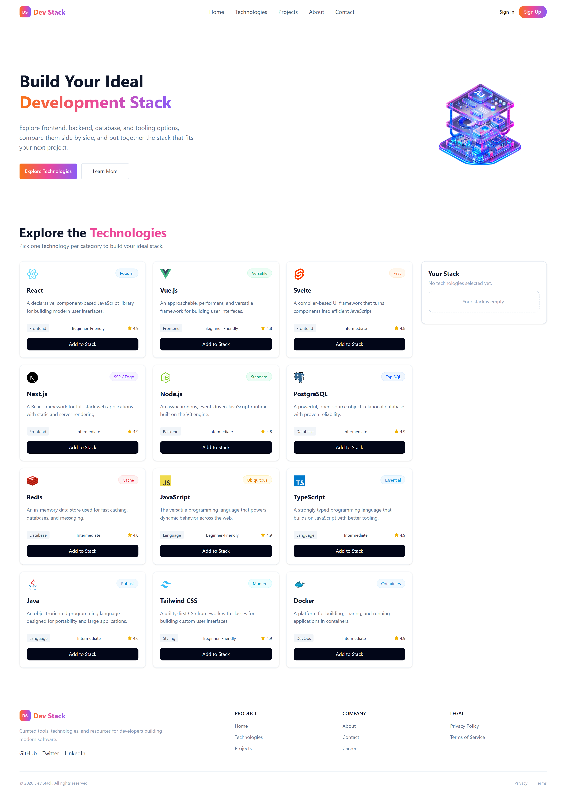

# Dev Stack Builder

Explore development technologies and put together your own stack.

Dev Stack Builder is a responsive React application where users
can browse technology cards, select tools, and manage their stack
from an interactive sidebar.

[View Live Demo](https://dev-staaack.vercel.app/)

## Project Preview



## Key Features

### 1. Explore Technologies

Browse 12 technologies loaded from a local JSON file.
Each card displays an icon, badge, description, category,
difficulty level, and star rating.

The layout shows one column on mobile, two on tablet,
and three on desktop.

### 2. Build and Manage Your Stack

Add technologies to the Your Stack panel and see the
selected count update immediately.

Selected cards display a highlighted border and a disabled
“✓ Added to Stack” button. Duplicate selections are prevented.
Users can remove one technology or clear the entire stack.

### 3. Clear Feedback and Loading States

React-Toastify provides notifications for adding technologies,
duplicate attempts, removing an item, and clearing the stack.

A loading spinner appears in the cards area while JSON data
is being fetched, keeping the surrounding section visible.

## Technology Stack

| Technology     | Purpose                                     |
| -------------- | ------------------------------------------- |
| React          | Components and interactive UI               |
| TypeScript     | Types for data, props, and handlers         |
| Tailwind CSS   | Styling and responsive layouts              |
| DaisyUI        | UI utilities and loading indicator          |
| React Icons    | Rating stars, check marks, and remove icons |
| React-Toastify | Action notifications                        |
| Vite           | Development server and production build     |
| JSON           | Technology catalog data                     |
| Vercel         | Website hosting                             |

## Design Details

- Sticky navbar with a responsive mobile layout.
- Hero section with a gradient heading and primary action.
- Responsive technology grid and stack sidebar.
- Mobile footer with centered branding and social links.
- Shared orange → pink → violet brand gradient.

The gradient is defined once as `--brand-gradient` in
`src/index.css`. Branding, the hero highlight, and the
Explore Technologies button reuse this value.

## Project Structure

| Path                                 | Description                            |
| ------------------------------------ | -------------------------------------- |
| `public/technologies.json`           | Technology catalog                     |
| `public/favicon.png`                 | Website favicon                        |
| `public/dev-stack-desktop.png`       | Project screenshot used in this README |
| `src/assets/`                        | Project images                         |
| `src/components/Navbar.tsx`          | Responsive navigation                  |
| `src/components/Hero.tsx`            | Hero content and banner                |
| `src/components/Technologies.tsx`    | Selected stack state and handlers      |
| `src/components/TechnologyCards.tsx` | Reads fetched data and renders cards   |
| `src/components/TechnologyCard.tsx`  | Individual technology card             |
| `src/components/Footer.tsx`          | Responsive footer                      |
| `src/Types/TechnologiesType.ts`      | Technology data type                   |
| `src/App.tsx`                        | Main application composition           |
| `src/index.css`                      | Global styles and shared gradient      |

## Getting Started

Download or clone this repository, then open a terminal
inside the project folder.

Install dependencies:

```bash
npm install
```

Start the development server:

```bash
npm run dev
```

Open the local URL printed in the terminal.

## Available Scripts

| Command           | Description                               |
| ----------------- | ----------------------------------------- |
| `npm run dev`     | Start the development server              |
| `npm run build`   | Check TypeScript and build for production |
| `npm run preview` | Preview the production build locally      |
| `npm run lint`    | Run ESLint checks                         |

## Current Scope

The technology catalog loads from a local JSON file.
Stack selections are stored in React state and reset
when the page is refreshed.

Sign In and Sign Up are UI elements; authentication
is not implemented.

## React Questions and Answers

### 1. What is JSX, and why is it used in React?

JSX lets me write HTML-like markup inside JavaScript.
It makes the UI easier to describe, and I can insert
dynamic values using curly braces. This TypeScript
project uses `.tsx` files for components.

### 2. What is the difference between props and state?

Props pass data from a parent to a child component.
State stores data that the component can update.

In this project, a card receives technology details
through props, while the selected stack is stored in state.

### 3. What does the useState hook do, and where did you use it in this project?

useState stores a value and gives me a function to update it.

I used it for selectedTechnologies. Adding or removing
a technology updates this state, which updates the cards,
sidebar, and selected count.

### 4. What does the useEffect hook do, and why did you need it to load the JSON data?

useEffect connects a component with external systems,
such as network requests. It can fetch JSON after rendering
and store the result in state.

In my implementation, I used a fetch promise with React's
use API and Suspense instead of useEffect. Suspense shows
the spinner while the promise is pending.

### 5. Why does every item in a .map() list need a unique key prop?

A key helps React identify each item when a list changes.
It should stay consistent and be unique within that list.

I used technology.id as the key for technology cards
and selected stack items.

### 6. What is conditional rendering? Show one place you used it.

Conditional rendering means showing different UI depending
on a condition.

I show the empty stack message only when nothing is selected:

```tsx
{
  selectedTechnologies.length === 0 && <p>Your stack is empty.</p>;
}
```

I also use it to switch the button text between
“Add to Stack” and “Added to Stack”.

### 7. How do you pass data from a parent component to a child component, and how does a child send something back to the parent?

The parent passes data and callback functions through props.
The child calls a callback with the relevant data when
an action happens.

My card calls handleAddToStack(technology) when clicked.
The parent handler then updates the selected stack.
